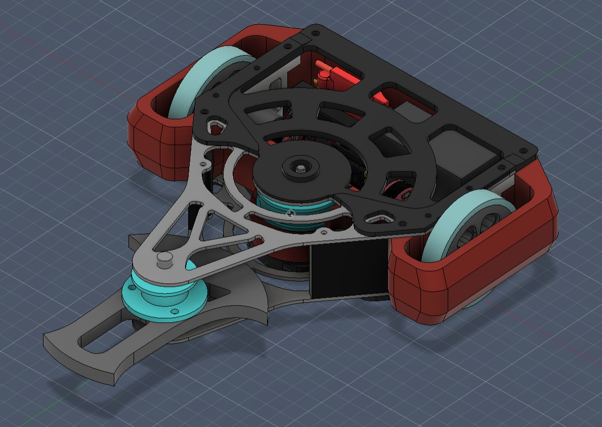
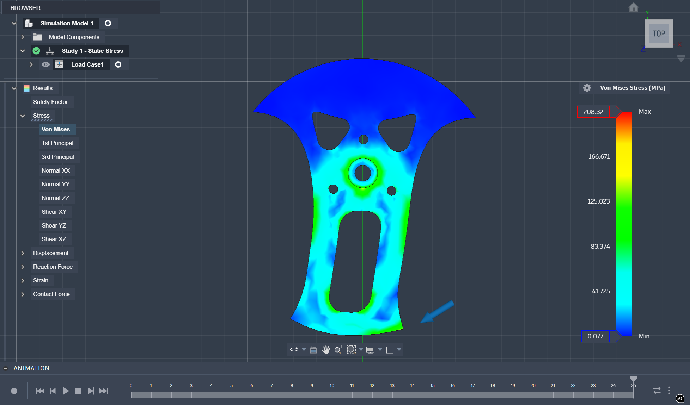
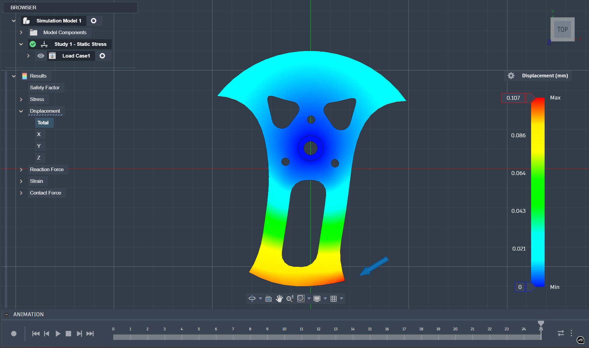
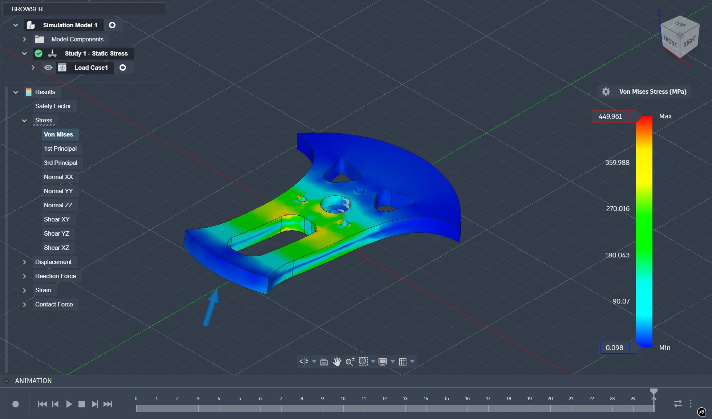
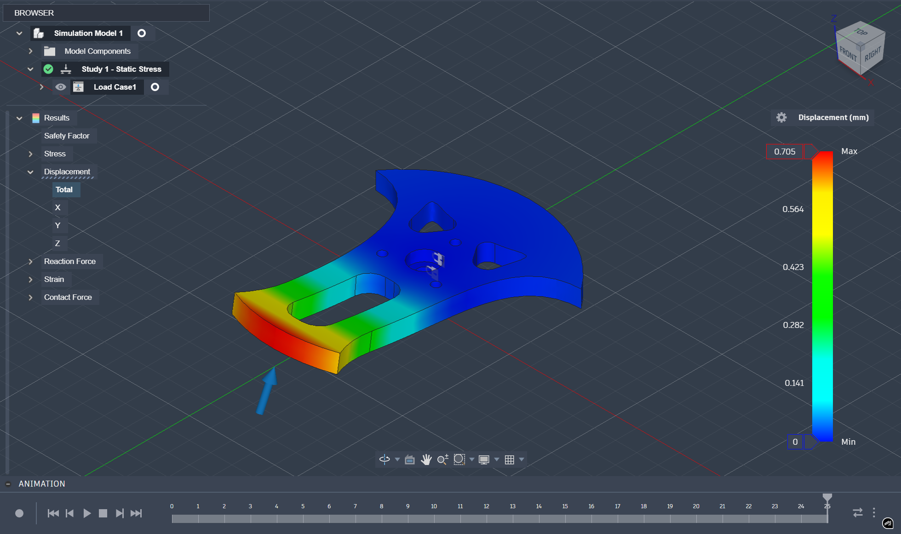
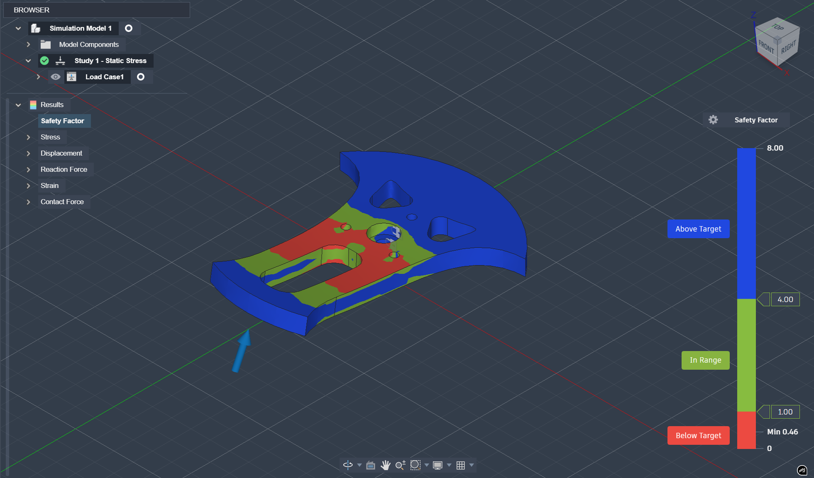
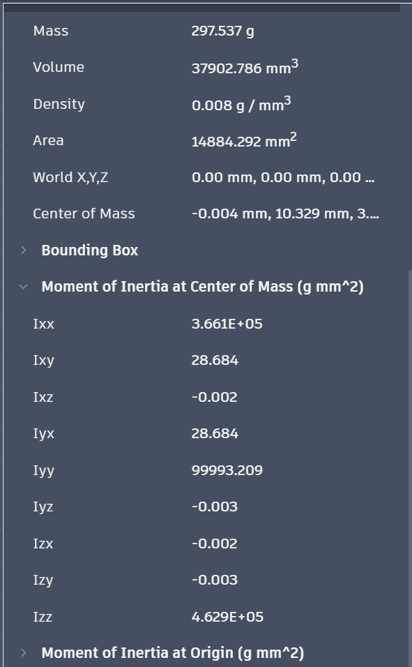

## Velociraptor
3lb horizontal combat robot designed in Fusion 360 with FEA-validated chassis and optimized weight distribution.

  

## 3lb Undercutter Combat Robot

This repository contains the complete mechanical design and structural validation of a 3lb (1.36 kg) horizontL combat robot developed for competitive robotics events.

The bot is designed with a low center-of-mass architecture, belt-driven horizontal spinner, and FEA-validated chassis optimized for impact resistance and weight efficiency.

## Project Overview

Velociraptor is a 3lb (1.36 kg) undercutter combat robot designed for high rotational energy storage and structural survivability under competitive impact conditions.

The weapon system stores ~470 J of kinetic energy at operational speed and has been structurally validated under 2000 N impact loading using static FEA.

This project demonstrates applied CAD design, structural simulation, material selection, and drivetrain optimization.

## KEY FEATURES

Horizontal spinner weapon system

Belt-driven transmission

Lightweight, FEA-optimized top and bottom plates

Reinforced weapon support structure

Modular internal layout for quick maintenance

Symmetrical drivetrain for stability

## ENGINEERING APPROACH

Designed in Fusion 360

Static stress analysis performed on:

Top plate

Weapon support arm

Motor mounts

Shape optimization to reduce weight while maintaining structural stiffness

Considered dynamic effects from high-RPM weapon loading

## DESIGN OBJECTIVES

Stay within 3lb weight constraint

Maximize weapon energy under motor limitations

Ensure structural integrity under impact loads

Maintain low center of gravity

Enable quick serviceability between matches

## TOOLS USED

CAD: Fusion 360

Simulation: Fusion 360 FEA (Static & Dynamic)

Fabrication: CNC-machined + custom components

## Electronics Configuration

- Weapon Motor: DYS 3530 1100KV
- Weapon ESC: Hobbywing 50A
- Drive ESC: BLHeli-S
- Battery: Scorpion 3S 1000mAh LiPo
- Pulley Ratio: 1.7:1 (Speed Increase)

The electrical system is designed to support high-speed weapon operation while maintaining safe current margins within ESC and battery limits.

## Weapon Structural Analysis (FEA)

Static structural analysis was performed using a 2000 N impact load to simulate worst-case engagement forces at the weapon bite region.

Material: Hardened EN24 Steel  
Yield Strength (conservative): ~850 MPa  

---

### Side Impact Load Case (2000 N)

#### Von Mises Stress

  

Maximum Stress: 449 MPa  
Estimated Factor of Safety: ~1.9  

Stress concentration occurs near the mounting interface but remains within acceptable limits for hardened EN24 under combat loading.

---

#### Displacement

  

Maximum Displacement: ~0.7 mm  
Deflection remains within acceptable operational tolerance.

---

#### Safety Factor

  

Most regions remain above target safety threshold.

---

### Upward Impact Load Case (2000 N)

#### Von Mises Stress

  

Maximum Stress: 208 MPa  

---

#### Displacement

  

Maximum Displacement: ~0.1 mm  

---

#### Safety Factor

  

All regions remain above acceptable safety threshold.

---

### Weapon Physical Properties

  

Weapon Mass: 0.297 kg  
Moment of Inertia (Izz): 4.629×10⁻⁴ kg·m²  
Diameter: 140.6 mm  
Bite: 15.8 mm
